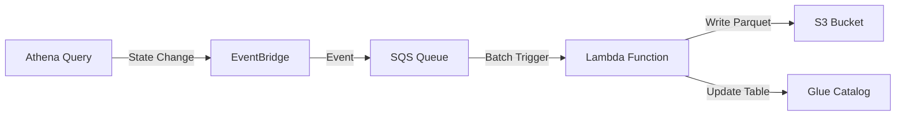

# Athena Query Monitoring

An event-driven solution using AWS Lambda, EventBridge, and SQS to monitor Athena query executions, capturing details like runtime and data scanned into a Glue Data Catalog.

## Architecture

The solution employs a serverless, event-driven architecture to minimize costs and ensure near real-time monitoring.



1.  **Event Capture**: Amazon EventBridge captures `Athena Query State Change` events (SUCCEEDED, FAILED, CANCELLED).
2.  **Buffering**: Events are sent to an SQS queue to handle bursts and allow batch processing.
3.  **Processing**: A Lambda function is triggered by SQS (batch size 50 or max 1 hour window).
4.  **Storage**: Query details are extracted and saved as Parquet files in S3, partitioned by the Glue Data Catalog.

## Key Features

-   **Dual-Mode Operation**:
    -   **Initial Backfill**: Automatically fetches all historical query executions on the first run.
    -   **Event-Driven**: Processes new queries incrementally as they complete.
-   **Cost-Effective**: Uses SQS batching to reduce Lambda invocations and avoids polling.
-   **Optimized Storage**: Stores data in Parquet format for efficient analysis.
-   **Resilient**: Includes a Dead Letter Queue (DLQ) for failed event processing.

## Prerequisites

-   **Python**: 3.12 or later
-   **AWS CDK CLI**: `npm install -g aws-cdk`
-   **uv**: For dependency management (recommended)

## Setup

1.  **Clone the repository**:
    ```bash
    git clone https://github.com/ayushacharya007/query-monitoring.git
    cd query_monitoring
    ```

2.  **Install Dependencies**:
    This project uses `uv` for dependency management.
    ```bash
    uv sync
    source .venv/bin/activate
    ```

3.  **Configure Environment**:
    Create a `.env` file in the project root:
    ```ini
    ACCOUNT_ID=<your-aws-account-id>
    REGION=<your-aws-region>
    LAMBDA_LAYER_ARN=<arn-of-aws-wrangler-layer>
    ```

## Deployment

Deploy the stack to your AWS account:

```bash
cdk deploy
```

## Usage

### Initial Backfill
On the first deployment, the Lambda function will automatically detect that it hasn't run before (via SSM Parameter Store) and trigger a backfill of all historical queries in the primary workgroup.

### Ongoing Monitoring
Simply run queries in Athena. The system will automatically capture their details and append them to the `query_monitoring` table in your Glue Database.

### Analyzing Data
You can query the monitoring data itself using Athena:

```sql
SELECT * FROM "query_monitoring_db"."query_monitoring"
ORDER BY date DESC
LIMIT 10;
```
